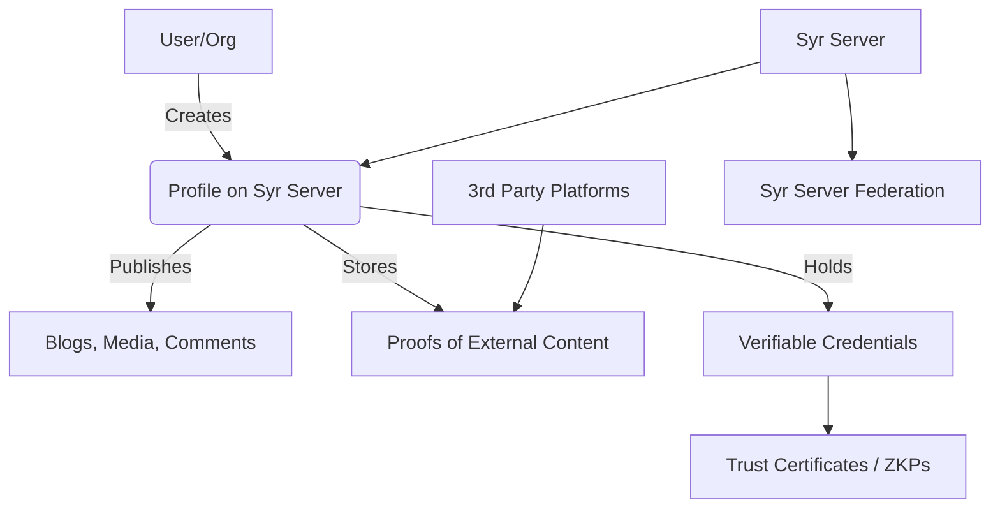
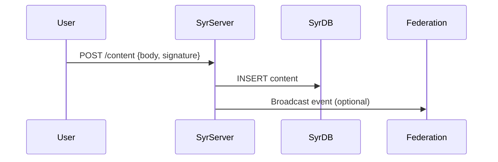
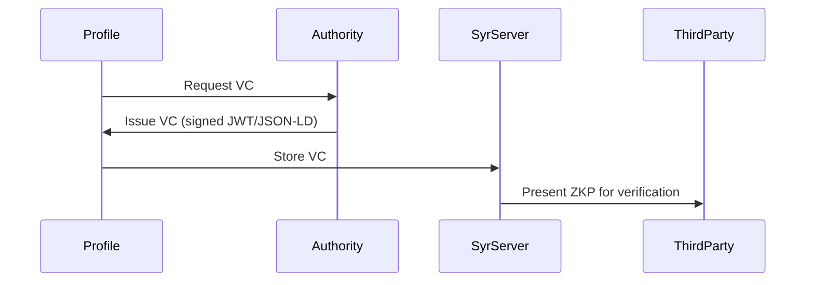

## Abstract

The modern internet is fragmented across centralized platforms that control both identity and content. Individuals and organizations have little sovereignty over their data, and their online personas are tightly coupled to the services that host them. Syr proposes a decentralized identity and content hosting system, enabling anyone to run a Syr Server on any domain/subdomain. Each Syr server supports user Profiles, hosting both original content and cryptographic proofs of content published elsewhere.

To balance sovereignty with trust and security, Syr integrates W3C Verifiable Credentials (VCs) and Zero-Knowledge Proofs (ZKPs) to establish attestations of identity, trust, and content authenticity across Syr servers and third-party platforms.

This paper outlines the problem, design principles, database schemas, protocol flows, and interoperability requirements to build Syr into a secure, extensible, and human-centric platform.

## 1. Problem

- Platform Lock-In: Identities and content are locked into centralized silos (e.g., Twitter, Medium, Substack).
- Lack of Interoperability: Cross-platform proofs of authorship and integrity are hard to establish.
- Identity/Trust Gaps: Anonymous or pseudonymous accounts are easily weaponized for spam, misinformation, or malicious activity.
- Missing Verification Layer: There is no standard mechanism to prove ownership of identity without over-revealing personal data.

## 2. Syr Vision

- Any domain/subdomain can host a Syr Server.
- Profiles represent personas (individuals, organizations, pseudonymous entities).
- Profiles host:
  - Original content (blogs, media, comments).
  - Proofs of external content published elsewhere.
- Trust: Optional enforcement of VCs/ZKPs for account credibility.
- Federation: Syr servers interconnect with each other and with third-party platforms using trust certificates or external attestations (KYC providers, organizations, DAOs).

## 3. System Architecture

### Components

- Syr Server
  - Hosts profiles/accounts.
  - Exposes APIs for publishing content and verifying proofs.
  - Stores Verifiable Credentials and Trust Certificates.
- Profiles
  - User accounts tied to cryptographic keys (DID-based).
  - Hold content and verifiable proofs.
- Credential Authority / KYC Provider (optional)
  - Issues signed VCs based on static IDs (Aadhaar, PAN, Passport, etc.).
  - May also be another Syr server with elevated trust.
- Transport Layer
  - REST/GraphQL + Event subscriptions (Webhooks/WebSockets).
  - Content proofs + VC exchanges use DIDComm or JSON-LD-based W3C VC formats.

### High-Level Architecture



## 4. Database Schema (SurrealDB / SQL-like)

### Profiles

```sql
CREATE TABLE profiles (
  id STRING PRIMARY KEY,
  did STRING UNIQUE, -- W3C DID identifier
  handle STRING UNIQUE, -- username@domain
  display_name STRING,
  bio TEXT,
  created_at TIMESTAMP,
  updated_at TIMESTAMP
);
```

### Content

```sql
CREATE TABLE content (
  id STRING PRIMARY KEY,
  profile_id STRING REFERENCES profiles(id),
  type ENUM('blog','media','comment','proof'),
  body JSON, -- supports structured blocks (markdown/media refs)
  hash STRING, -- SHA-256 for integrity
  created_at TIMESTAMP
);
```

### Proofs

```sql
CREATE TABLE proofs (
  id STRING PRIMARY KEY,
  profile_id STRING REFERENCES profiles(id),
  external_url STRING,
  external_hash STRING,
  signature STRING,
  issued_at TIMESTAMP,
  verified BOOLEAN DEFAULT FALSE
);
```

### Verifiable Credentials

```sql
CREATE TABLE credentials (
  id STRING PRIMARY KEY,
  holder_profile_id STRING REFERENCES profiles(id),
  issuer_did STRING,
  credential JSON, -- JSON-LD W3C VC payload
  zkp_proof JSON, -- optional ZKP data
  issued_at TIMESTAMP,
  expires_at TIMESTAMP
);
```

### Trust Certificates

```sql
CREATE TABLE trust_certificates (
  id STRING PRIMARY KEY,
  issuer_profile_id STRING REFERENCES profiles(id),
  subject_profile_id STRING REFERENCES profiles(id),
  level ENUM('basic','verified','kyc','org','zkp'),
  issued_at TIMESTAMP,
  expires_at TIMESTAMP
);
```

## 5. Transport Layer & Protocol Flows

### 5.1 Publishing Content

1. User signs content hash with private key.
2. Content + signature transmitted to Syr Server over HTTPS (REST/GraphQL).
3. Server stores hash + signature in DB.



### 5.2 Cross-Platform Proofs

1. User posts content on Twitter/Medium.
2. Generates hash + DID-signed statement ("I published this at X").
3. Syr server stores proof linking DID + external URL.
4. Proof verification is attempted by crawling external link or verifying signature.

### 5.3 Verifiable Credential Exchange

1. Credential Authority issues VC to Profile DID.
2. Profile stores VC in Syr Server DB.
3. ZKP allows selective disclosure (e.g., prove "over 18" without revealing DOB).



### 5.4 Trust Certificates

1. Syr profiles issue certificates to each other (like SSL/TLS).
2. Levels of trust define how much weight to assign to content (anti-spam, moderation).
3. Third-party platforms may require certain levels of trust before accepting content.

## 6. Business Logic

- Content Integrity: Every piece of content is hashed + signed.
- Proof Linking: External proofs use cross-signatures.
- Credential Validation: Expiry checks + revocation list handling.
- ZKP Support: Profiles can present only necessary attributes.
- Trust Scoring: Profiles aggregate certificates from trusted peers/authorities.

## 7. Security Considerations

- Sybil Resistance: VCs/Trust Certs make spam costly.
- Selective Disclosure: ZKP prevents oversharing personal data.
- Replay Protection: Nonces + timestamps for proofs.
- Data Sovereignty: Users retain keys + can migrate profiles.
- Federation Security: Mutual TLS/DIDComm for server-server comms.

## 8. Interoperability

- W3C DID/VC Standards ensure compatibility with existing identity ecosystems.
- Content Addressing (IPFS optional) for media distribution.
- Pluggable Credential Authorities (govt IDs, DAOs, universities, orgs).
- Transport Flexibility (REST, ActivityPub-like federation, DIDComm).

## 9. Conclusion

Syr enables individuals and organizations to host self-sovereign identities, content, and verifiable proofs on their own domain. By combining decentralized profiles, federated content, and VC/ZKP-based trust, Syr balances freedom with accountability — creating a human-centric, interoperable layer for the next internet.